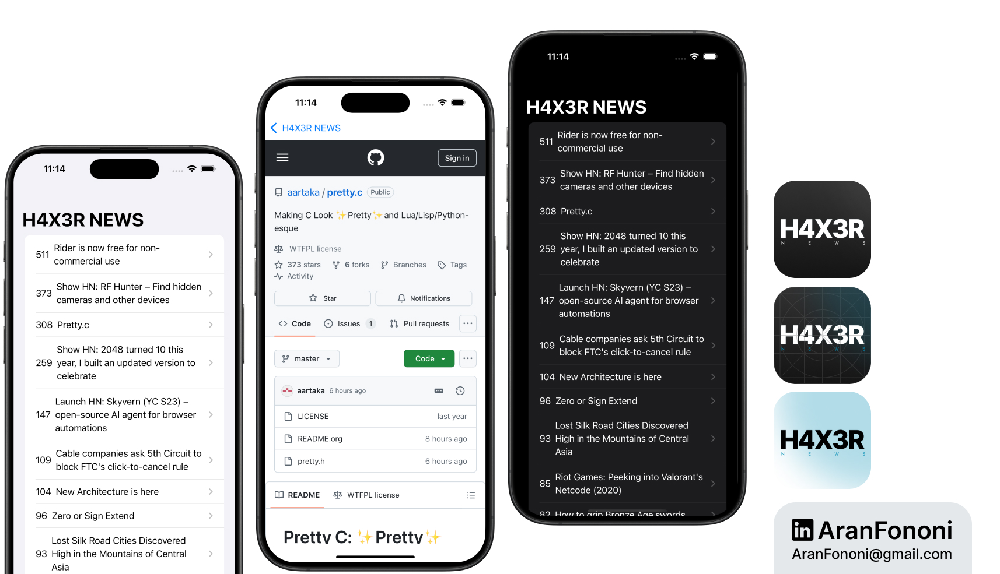

# H4X0R News

### Project for Section 17: **Hacker News Reader**  
This project was completed as part of Section 17 in the **Complete iOS Development Bootcamp** by Angela Yu.

## Project Overview
**H4X0R News** is a SwiftUI-based app that retrieves and displays the top stories from the Hacker News API. Users can click on headlines to read articles directly within the app using a built-in WebView.

## What I Learned
In this project, I focused on:
- **SwiftUI Integration**: Developed the user interface entirely with SwiftUI, learning about NavigationViews, Lists, and HStacks.
- **Network Calls**: Used `URLSession` to fetch JSON data asynchronously from the Hacker News API.
- **Data Binding**: Applied `@ObservedObject` and `@Published` properties for dynamic data handling between views.
- **WebView Implementation**: Integrated a WebView to load external content directly within the app using `UIViewRepresentable`.

## Key Skills
- Building interactive UIs with SwiftUI components
- Handling state and data binding for responsive user interactions
- Parsing JSON data and displaying it in lists

## Additional Features
- Dynamic NavigationLink destinations to open each article within the app.
- WebView integration with `UIViewRepresentable` for seamless web content display.

---

### Project Preview

---

### Footer

---

## Contact
For more information, feel free to reach out:  
- **Email**: [aranfononi@gmail.com](mailto:aranfononi@gmail.com)  
- **LinkedIn**: [Aran Fononi](https://www.linkedin.com/in/aran-fononi-18182b265)
